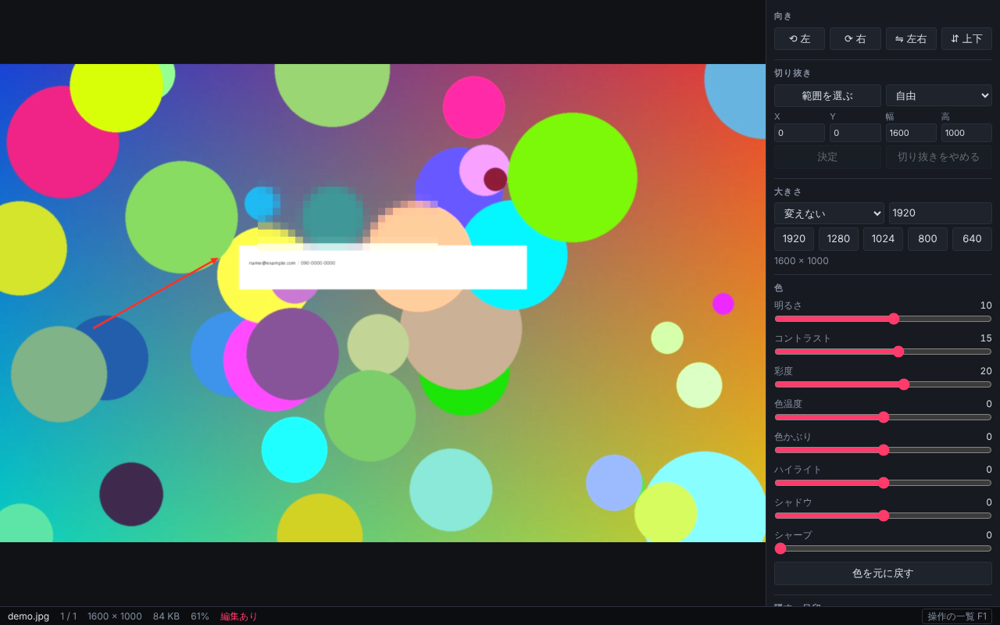

# Lookover

[English](README.md) | **日本語**



見ている画像を、その場で直せる Windows 用の小さな画像ビューア。
ふだんは見るだけ。回転・切り抜き・縮小・色の調整・モザイク・矢印が必要になったら、そのまま直して、ワンキーで書き出す。別の編集アプリを開き直さなくていい。

ブログや NOTE に上げる画像を用意するたびに別のアプリを開くのが面倒で、Honeyview の置き換えとして自分用に作った。Tauri v2 + 素の JavaScript (ビルドツールも UI ライブラリも無し)。

## できること

**見る**
- フォルダ内の送り (自然順: `img2` が `img10` より前)、前後の画像の先読み
- 拡大・縮小、全体表示、等倍 (表示倍率 150% でも「画像の 1 画素 = 画面の 1 画素」)、全画面
- 動く GIF / WebP
- 編集中に <kbd>\\</kbd> を押している間だけ、元の絵を見る

**直す** (元のファイルは触らない。書き出すまでは画面の上だけ)
- 回転・反転、切り抜き (自由 / 比率固定)、大きさ
- 明るさ・コントラスト・彩度・色温度・色かぶり・ハイライト・シャドウ・シャープ (WebGL)
- モザイク・ぼかし・塗りつぶし・枠・矢印
- 取り消し・やり直し。アプリを開いている間は、ファイルごとの編集を覚えている

**出す**
- WebP / JPEG / PNG
- **ワンキー書き出し**: <kbd>Ctrl</kbd>+<kbd>1</kbd> で、長辺 1920 の WebP を元の画像と同じフォルダへ、など。プリセットは編集できる
- プリセットでは元のファイルを上書きしない (同名があれば `-2`, `-3` … を付ける)
- クリップボードへのコピー、クリップボードの画像を開く

**ほか**
- 名前の変更 (<kbd>F2</kbd>)、ごみ箱へ (<kbd>Delete</kbd>、確認は切れる)、エクスプローラーで場所を開く
- ドロップで開く。2 つ目を起動しても、動いている窓で開く
- **キーは全部付け替えられる** (<kbd>F1</kbd> →「キーを変える」)。<kbd>F1</kbd> で操作の一覧も出る

対応形式: PNG / JPEG / WebP / GIF / BMP / AVIF / ICO / SVG

## 入れる

1. [Releases](../../releases) から、インストーラー (`.msi` か `.exe`) を落として実行する。
2. **コード署名をしていない**ので、最初に Windows の SmartScreen が「不明な発行元」と出す。「詳細情報」→「実行」で進める。
3. ダブルクリックで開きたければ、Windows の設定の「既定のアプリ」で Lookover を選ぶ。

WebView2 が必要 (Windows 11 には最初から入っている)。

**macOS / Linux (試験的。ほとんど試していない)**: `.dmg` / `.deb` / `.AppImage` も作ってある。署名はしていない。Mac は初回だけ右クリック →「開く」(「壊れている」と出たら `xattr -cr /Applications/Lookover.app`)。この環境の WebView は WebP に書き出せないので、WebP のプリセットは自動で JPEG になる。

## 制限

- HEIC / JXL / RAW は開けない (`src/decode.js` の `registerDecoder` に足す口だけある)
- 書き出すと EXIF と色プロファイル (ICC) は消える (向きは絵に焼き込む)
- 書き出していない編集は、アプリを閉じると確認なしで消える
- 文字入れ、自由角度の回転、まとめて書き出し、サムネイル一覧、zip / rar の中の閲覧は無い
- 主に確かめたのは、作者の Windows 11 1 台。Mac / Linux 版は試験的

## 自分でビルドする

Node.js と Rust が要る (Windows は WebView2 も)。

```
npm install
npm run tauri dev        # 動かす (初回は Rust のビルドで数分)
npx tauri build --bundles nsis   # インストーラーを作る (Windows)
```

起動時に画像を渡す: `npx tauri dev -- C:\path\a.png`

### 試験

```
python3 test/make_images.py        # 試験用の画像 (Pillow が要る)
node test/serve.mjs                # 開発用サーバー。http://localhost:8770/?open=<パス> でブラウザでも動く
npm i --no-save playwright
node test/ui.mjs                   # 画面側の自動試験 (Chromium)
sh test/app.sh && python3 test/app-report.py   # Linux でアプリ本体を画面なしで起動して、Rust 側を試験
```

作りの話: [DESIGN.md](DESIGN.md)

## ライセンス

[MIT](LICENSE)
